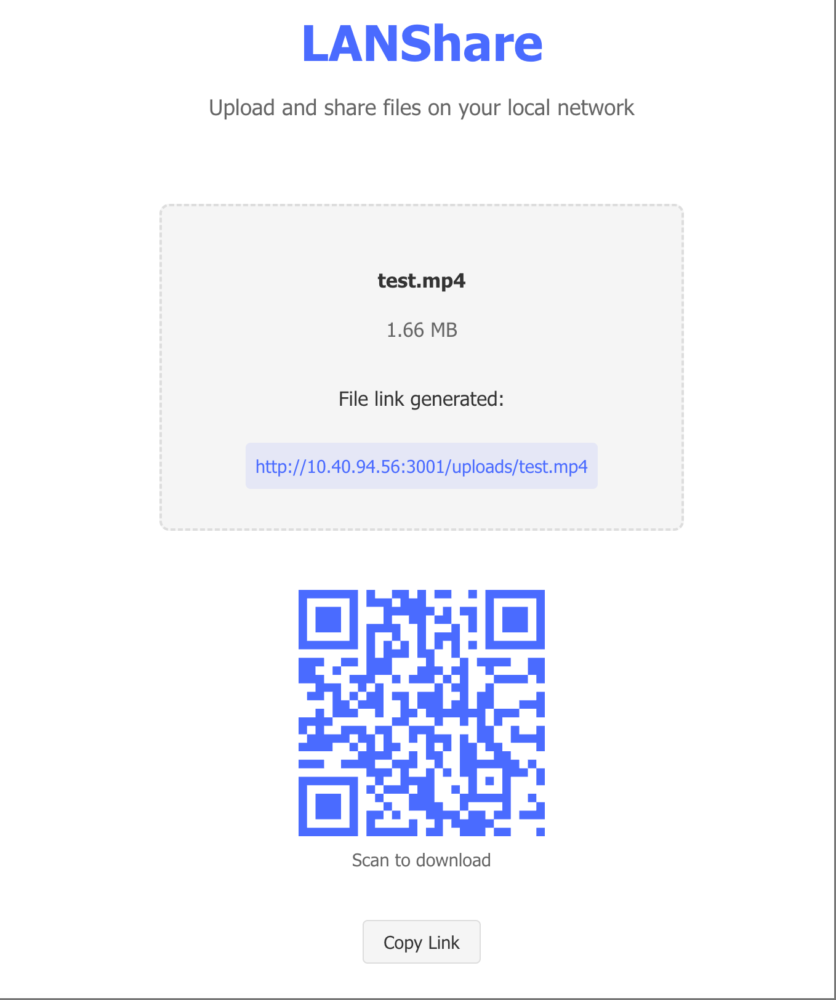

# LANShare

LANShare is a simple, easy-to-use file sharing application for your local network. It allows you to quickly share files between devices on the same network without the need for external services or complicated setup.



## Features

- **Instant File Sharing**: Upload files and immediately get a shareable link
- **QR Code Generation**: Each shared file gets a QR code for easy mobile access
- **LAN Access**: Access the application from any device on your local network
- **Drag & Drop Interface**: Simple and intuitive user interface
- **No File Size Limits**: Share files of any size (limited only by your network speed)
- **Automatic URL Encoding**: Properly handles filenames with spaces or non-Latin characters
- **Clean Up Utility**: One-click cleanup of all shared files


## Installation

### Prerequisites

- [Node.js](https://nodejs.org/) (v14 or higher)
- npm (comes with Node.js)

### Setup

1. Clone this repository:
   ```bash
   git clone https://github.com/yourusername/lanshare.git
   cd lanshare
   ```

2. Install dependencies:
   ```bash
   npm install
   cd lanshare
   npm install
   ```

## Usage

### Starting the Application

You can start the application using one of the following methods:

#### Using One-Click Startup Scripts

**On Windows:**
Simply double-click the `start.bat` file in the root directory.

**On macOS/Linux:**
1. Make the script executable (one-time setup):
   ```bash
   chmod +x start.sh
   ```
2. Double-click the `start.sh` file or run it from the terminal:
   ```bash
   ./start.sh
   ```

These scripts will:
1. Build the web application
2. Start both the backend server and frontend application
3. Open the application in your default browser

#### Manual Start

1. Start the server:
   ```bash
   node server.js
   ```

2. In a separate terminal, start the frontend development server:
   ```bash
   cd lanshare
   npm run dev
   ```

### Accessing the Application

Once started, the application will be available at:

- **Local access**: [http://localhost:3001](http://localhost:3001)
- **LAN access**: The application will display the LAN access URL when started

### Sharing Files

1. Drag and drop a file onto the upload area, or click to select a file
2. The file will be automatically uploaded and a shareable link will be generated
3. Once uploaded, you'll get a shareable link and QR code
4. Share the link or QR code with anyone on your local network
5. They can access the file by opening the link in their browser or scanning the QR code

### Cleaning Up

Click the "Clean Uploads Directory" button at the bottom of the page to remove all shared files.

## Technologies Used

- **Backend**: Node.js with Express.js
- **Frontend**: React with TypeScript and Vite
- **File Handling**: express-fileupload
- **QR Code Generation**: react-qr-code

## License

[MIT License](LICENSE)

## Contributing

Contributions are welcome! Please feel free to submit a Pull Request.
